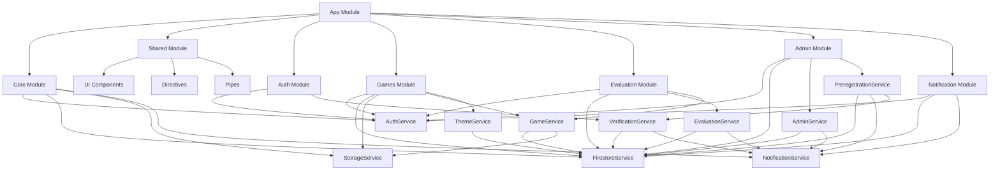
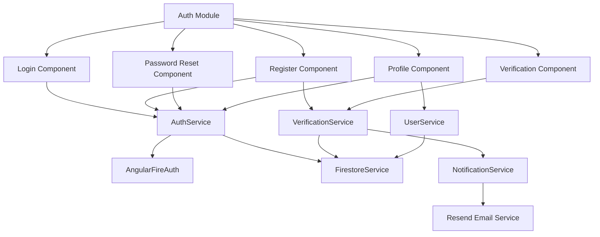
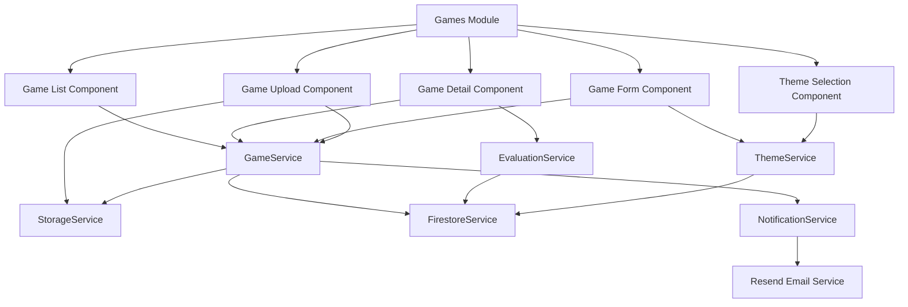
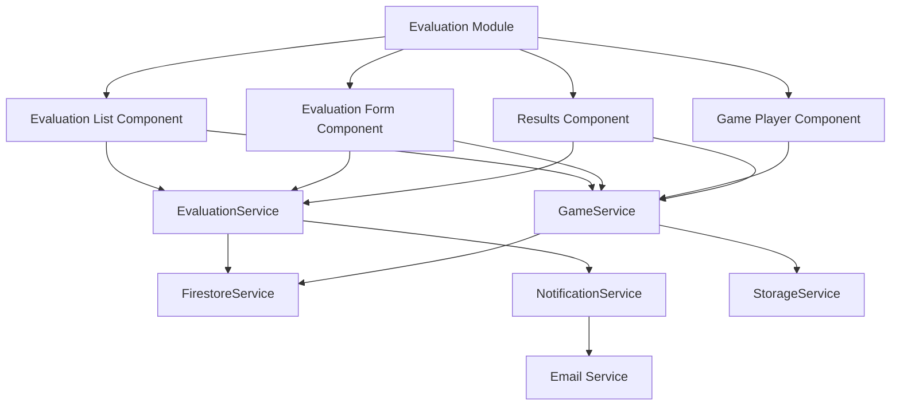
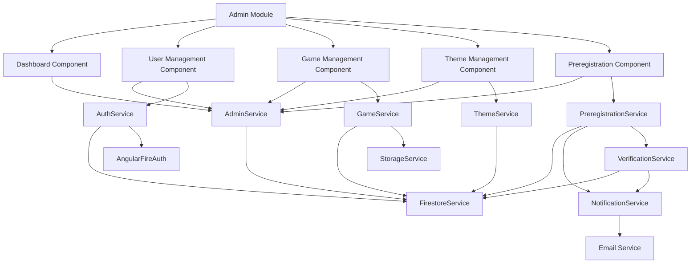
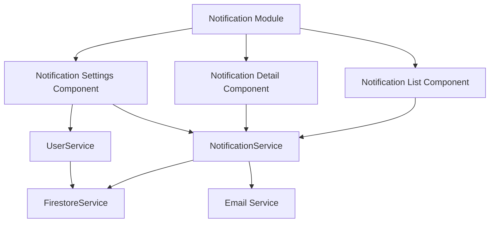
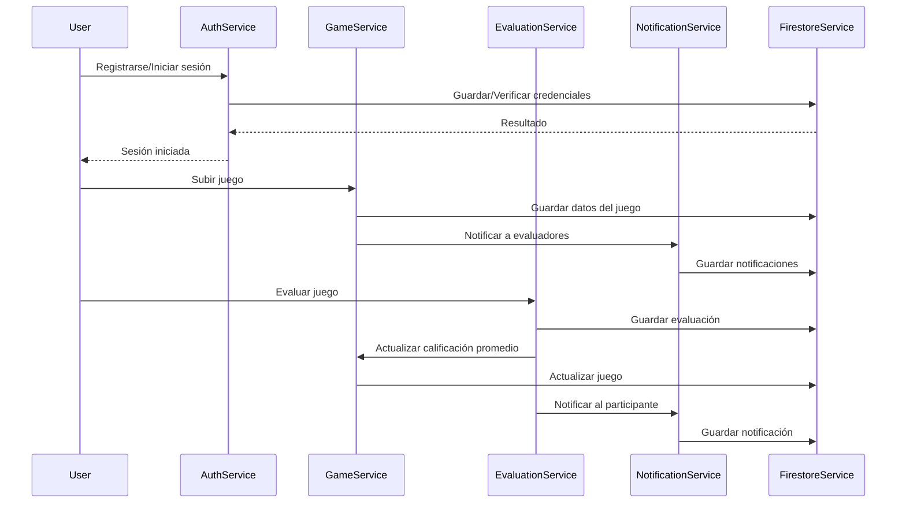

# Diagrama de Dependencias

Este documento proporciona una visualización clara de cómo los diferentes módulos y componentes se relacionan entre sí en la plataforma de competencia de minijuegos.

## Índice

1. [Diagrama General](#diagrama-general)
2. [Dependencias del Módulo de Autenticación](#dependencias-del-módulo-de-autenticación)
3. [Dependencias del Módulo de Gestión de Juegos](#dependencias-del-módulo-de-gestión-de-juegos)
4. [Dependencias del Módulo de Evaluación](#dependencias-del-módulo-de-evaluación)
5. [Dependencias del Módulo de Administración](#dependencias-del-módulo-de-administración)
6. [Dependencias del Módulo de Notificaciones](#dependencias-del-módulo-de-notificaciones)

## Diagrama General

## Dependencias del Módulo de Autenticación

### Descripción de Dependencias

- **AuthService**: Gestiona la autenticación de usuarios, registro, inicio de sesión y cierre de sesión.
- **VerificationService**: Maneja la verificación de correos electrónicos mediante códigos.
- **UserService**: Gestiona la información de perfil de los usuarios.
- **FirestoreService**: Proporciona acceso a la base de datos Firestore.
- **NotificationService**: Gestiona el envío de notificaciones por correo electrónico y en la plataforma.

## Dependencias del Módulo de Gestión de Juegos

### Descripción de Dependencias

- **GameService**: Gestiona la creación, actualización, eliminación y consulta de juegos.
- **ThemeService**: Gestiona las temáticas disponibles para los juegos.
- **StorageService**: Gestiona el almacenamiento de archivos (juegos WebGL, imágenes).
- **EvaluationService**: Proporciona acceso a las evaluaciones de los juegos.
- **FirestoreService**: Proporciona acceso a la base de datos Firestore.
- **NotificationService**: Gestiona el envío de notificaciones.

## Dependencias del Módulo de Evaluación

### Descripción de Dependencias

- **EvaluationService**: Gestiona la creación, actualización y consulta de evaluaciones.
- **GameService**: Proporciona acceso a los juegos que se van a evaluar.
- **FirestoreService**: Proporciona acceso a la base de datos Firestore.
- **NotificationService**: Gestiona el envío de notificaciones a los participantes.
- **StorageService**: Proporciona acceso a los archivos de los juegos.

## Dependencias del Módulo de Administración

### Descripción de Dependencias

- **AdminService**: Proporciona funcionalidades específicas para administradores.
- **AuthService**: Gestiona la autenticación y los roles de usuarios.
- **GameService**: Gestiona los juegos en la plataforma.
- **ThemeService**: Gestiona las temáticas disponibles.
- **PreregistrationService**: Gestiona el preregistro masivo de alumnos.
- **FirestoreService**: Proporciona acceso a la base de datos Firestore.
- **StorageService**: Gestiona el almacenamiento de archivos.
- **NotificationService**: Gestiona el envío de notificaciones.
- **VerificationService**: Gestiona la verificación de correos electrónicos.

## Dependencias del Módulo de Notificaciones

### Descripción de Dependencias

- **NotificationService**: Gestiona el envío y consulta de notificaciones.
- **UserService**: Gestiona las preferencias de notificación de los usuarios.
- **FirestoreService**: Proporciona acceso a la base de datos Firestore.
- **Email Service**: Servicio externo para el envío de correos electrónicos (Resend).

## Flujo de Datos entre Servicios

